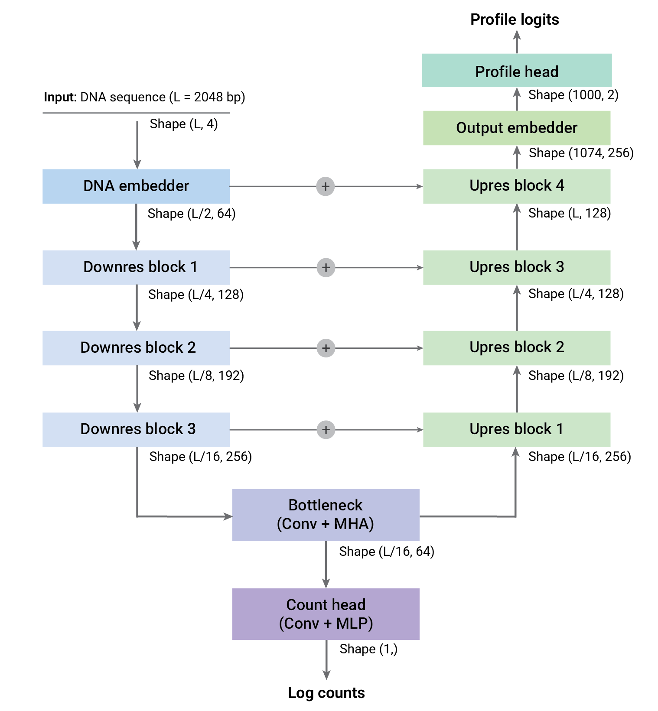

# DRYNet

DRYNet (Dual Resolution Y-Net) predicts both base-resolution signal profiles and total signal counts from one-hot encoded DNA sequence. Its key design is a Y-net structure: profile prediction follows the encoder-decoder path, while count prediction can branch from the bottleneck representation.
The convolutional modules and blocks follow an AlphaGenome-style sequence
modeling design.

## Requirements
* PyTorch
* Optional: PyYAML, only if loading YAML configs with `load_config`

## Usage

```python
import torch

from drynet import DRYNet, default_config

config = default_config()
model = DRYNet(config)

x = torch.randn(2, 4, 2048)
profile_logits, log_counts = model(x)

print(profile_logits.shape)  # (2, 2, 1000)
print(log_counts.shape)      # (2, 1)
```

Inputs may be shaped as either `(batch, 4, L)` or `(batch, L, 4)`.

You can also load model configuration from YAML (with `pip install pyyaml`):

```python
from drynet import DRYNet, load_config

config = load_config("configs/default.yaml")
model = DRYNet(config)
```

## Configuration Notes

The default configuration is a reasonable starting point, but it is not a
strictly tuned recipe. In a local hyperparameter search with PRO-cap data,
performance was not very sensitive to the exact hyperparameter set within the
tested neighborhood. It is unclear how broadly that observation generalizes, so
feedback and results from other settings are welcome.

## Checkpoints

Use plain PyTorch state dicts:

```python
torch.save(model.state_dict(), "drynet_state_dict.pt")

model = DRYNet(default_config())
model.load_state_dict(torch.load("drynet_state_dict.pt", map_location="cpu"))
```

If you have weights from another training framework, export them to a plain
PyTorch state dict before sharing them with this module.

## Smoke Test

From the parent repository root:

```bash
PYTHONPATH=drynet python drynet/examples/smoke_test.py
```

## Architecture

Most convolutional blocks and modules follow the AlphaGenome-style sequence
modeling design. DRYNet uses an encoder-decoder backbone with skip connections,
then predicts stranded profiles from decoder embeddings and total signal counts
from a separate count head.

The default bottleneck uses 2 hybrid-attention blocks. Each hybrid-attention
block combines a residual convolution unit with multi-head self-attention.

The following represents the simplified architecture with default configurations.


